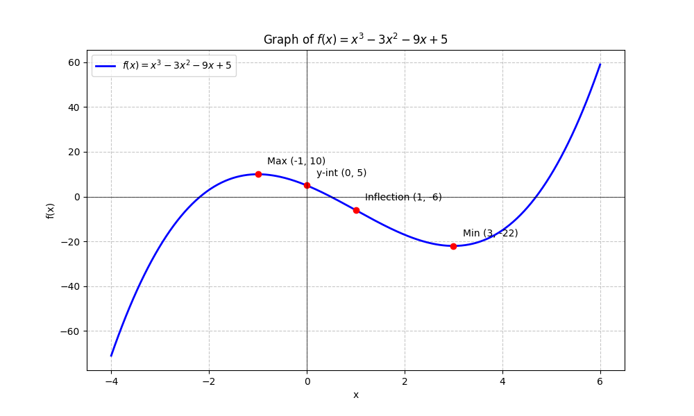

# CLASS NOTES: ANALYZING & GRAPHING FUNCTIONS

**Topic:** Curve Sketching using Derivatives
**Subject:** Calculus I

## Outline for Sketching

To graph a function $f(x)$ accurately without a calculator, follow this checklist.

---

### I. Pre-Calculus Analysis

**1. Domain**
Where is the function defined? Watch out for:

*   Division by zero (Denominators $= 0$).
*   Square roots of negatives ($< 0$).
*   Logs of non-positives ($\le 0$).

**2. Intercepts**

*   **y-intercept:** Set $x = 0$ ($f(0)$).
*   **x-intercepts:** Set $y = 0$ ($f(x) = 0$).

**3. Asymptotes**

*   **Vertical Asymptote (VA):** Where $\lim_{x \to c} f(x) = \pm \infty$. (Usually where denominator is 0 but numerator isn't).
*   **Horizontal Asymptote (HA):** Check limits at infinity: $\lim_{x \to \pm \infty} f(x) = L$.

---

### II. First Derivative Analysis ($f'$)

**Goal: Slope & Direction**

**1. Find $f'(x)$**
Set $f'(x) = 0$ or find where undefined to locate **Critical Points** (CPs).

**2. Sign Chart for $f'$**
Test intervals between CPs.

*   **$f'(x) > 0$ (+):** Function is **Increasing** ($\nearrow$).
*   **$f'(x) < 0$ (-):** Function is **Decreasing** ($\searrow$).

**3. Local Extrema**

*   **Local Max:** $f'$ changes from $(+)$ to $(-)$.
*   **Local Min:** $f'$ changes from $(-)$ to $(+)$.

---

### III. Second Derivative Analysis ($f''$)

**Goal: Curvature (Concavity)**

**1. Find $f''(x)$**
Set $f''(x) = 0$ or find where undefined.

**2. Sign Chart for $f''$**

*   **$f''(x) > 0$ (+):** Concave **UP** ($\cup$) (Like a cup, holds water).
*   **$f''(x) < 0$ (-):** Concave **DOWN** ($\cap$) (Like a frown, spills water).

**3. Inflection Points**
Points where concavity changes (sign of $f''$ switches) AND the point exists.

---

### IV. Summary Table & Sketch

Combine all info into a table before drawing.

| Interval | $f'$ Sign | Behavior | $f''$ Sign | Concavity | Shape |
| :--- | :---: | :--- | :---: | :--- | :--- |
| $x < -2$ | $+$ | Incr | $-$ | Down | $\nearrow \cap$ |
| $-2 < x < 0$ | $-$ | Decr | $-$ | Down | $\searrow \cap$ |
| $x > 0$ | $-$ | Decr | $+$ | Up | $\searrow \cup$ |

**Drawing Steps:**

1.  Plot Intercepts, Holes, and Asymptotes (dashed lines).
2.  Plot Max/Min and Inflection Points.
3.  Connect the dots following the "Shape" guidance.

---

## V. Full Example

**Problem:** Sketch $f(x) = x^3 - 3x^2 - 9x + 5$

### 1. Pre-Calc

*   **Domain:** $(-\infty, \infty)$ (Polynomial).
*   **y-int:** $f(0) = 5$.
*   **Asymptotes:** None. $\lim_{x \to \infty} f(x) = \infty$, $\lim_{x \to -\infty} f(x) = -\infty$.

### 2. First Derivative
$$f'(x) = 3x^2 - 6x - 9$$

$$f'(x) = 3(x^2 - 2x - 3) = 3(x-3)(x+1)$$

**Critical Points:** $x = 3, x = -1$.

**Sign Chart ($f'$):**

*   $(-\infty, -1)$: Test $-2 \rightarrow f'(-2) = 3(-5)(-1) = (+) \rightarrow$ **Inc**.
*   $(-1, 3)$: Test $0 \rightarrow f'(0) = -9 = (-) \rightarrow$ **Dec**.
*   $(3, \infty)$: Test $4 \rightarrow f'(4) = 3(1)(5) = (+) \rightarrow$ **Inc**.

**Extrema:**

*   **Max at $x=-1$:** $f(-1) = (-1)^3 -3(1) -9(-1) + 5 = -1 -3 +9 +5 = \mathbf{10}$. Point: $(-1, 10)$.
*   **Min at $x=3$:** $f(3) = 27 - 27 - 27 + 5 = \mathbf{-22}$. Point: $(3, -22)$.

### 3. Second Derivative
$$f''(x) = 6x - 6$$

$$f''(x) = 6(x-1)$$

**Inflection Point:** $x = 1$.

**Sign Chart ($f''$):**

*   $(-\infty, 1)$: Test $0 \rightarrow f''(0) = -6 = (-) \rightarrow$ **Concave Down**.
*   $(1, \infty)$: Test $2 \rightarrow f''(2) = 6 = (+) \rightarrow$ **Concave Up**.

**Value at Inflection:** $f(1) = 1 - 3 - 9 + 5 = -6$. Point: $(1, -6)$.

### 4. Summary & Sketch
*   Start at $(-\infty, -\infty)$.
*   Go **UP** to Max $(-1, 10)$ (Concave Down).
*   Go **DOWN** through y-int $(0, 5)$ and Inflection $(1, -6)$.
*   Switch to Concave Up, continue **DOWN** to Min $(3, -22)$.
*   Go **UP** to $(\infty, \infty)$.

**Visual Verification:**

*The graph confirms our analysis: Max at (-1, 10), Min at (3, -22), and Inflection at (1, -6).*
